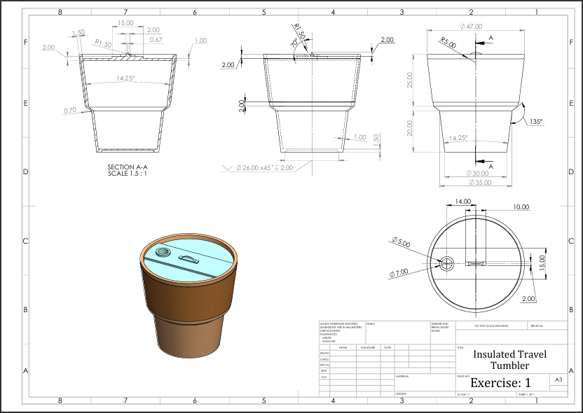

# Exercise 1: Hydro-Sleeve insulated Travel Tumbler
**Difficulty:** *Beginner - Intermediate*

Welcome to **Exercise 1** of the *CAD Practice* Series! 

This challenge focuses on creating a modern, 3-piece **Insulated Travel Tumbler** featuring a tapered main vessel, a textured heat-sleeve, and a press-fit lid with an integrated spout.

---

## 🎯 Skill Check & Core Concepts
This exercise is designed to test your proficiency with foundational 3D modelling operations and drafting interpretation:
* **Revolved Boss/Base & Cut:** Main vessel profile and central axis symmetry.
* **Draft Angles & Tapers:** Working with $14.25^\circ$ uniform draft angles.
* **Thin-Wall Geometry (Shelling):** Managing variable internal wall thicknesses ($0.70\text{ mm}$ to $1.50\text{ mm}$).
* **Multi-Body Assemblies:** Creating mating sleeve and lid components based on parent geometry.

---

## 📐 Blueprint & Technical Drawings

Below is the detailed engineering drawing sheet. Pay close attention to **`SECTION A-A`** to accurately model the internal wall steps and lid retention profiles.

### Key Specifications:
* **Major Heights:** $45.00\text{ mm}$ ($25.00\text{ mm}$ upper section / $20.00\text{ mm}$ lower section)
* **Max Rim Diameter:** $\varnothing 47.00\text{ mm}$
* **Base Diameter:** $\varnothing 30.00\text{ mm}$
* **Main Vessel Draft Angle:** $14.25^\circ$
* **Base Chamfer:** $26.00\text{ mm} \times 45^\circ \downarrow 2.00\text{ mm}$

---

## 💡 Pro Tips for Modelling

1. **Start with the Main Body Profile:** Sketch half of the main cup profile on the Front Plane and use a **Revolve** command rather than multiple extrusions to maintain clean geometry.
2. **Handle the Lid Lips:** Reference the $70^\circ$ draft angle and $R1.50\text{ mm}$ fillets on `SECTION A-A` for a proper press-fit seal.
3. **Sleeve Creation:** Use the outer faces of the main cup as offset references to model the sleeve so it fits perfectly in assembly.

---

## 📁 Downloads & Resources
* 📄 [Download High-Resolution Drawing (PDF)](./files/Detailed-drawing.pdf)
* 📦 [Download Complete CAD Model (STEP)](./files/Tumbler.STEP)

---

### 💬 Show Your Work!
Did you complete this exercise? Share your completed model, feature tree, or render! If you encountered any tricky dimensions, drop a comment or open an issue in this repository.
