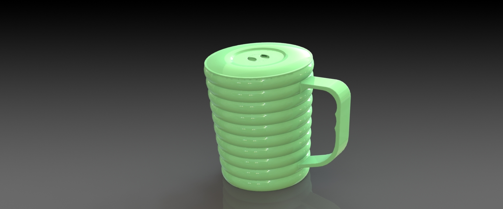

# List of Exercises

1. [Exercise 1: A Hydro-Sleeve Travel Tumbler](https://github.com/Snamosr/cad_exercises/tree/main/Exercise-1---The-HydroSleeve-Travel-Tumbler)
     - A parametric, insulated travel tumbler with snap-fit lid and textured sleeve — focuses on Revolve, Shell, and Assembly Mates.
       

2. [Exercise 2: A Ribbed Ergonomic Mug & Lid Assembly](https://github.com/Snamosr/cad_exercises/tree/main/Exercise-2---Ribbed-Mug-&-Lid-Assembly)
     - An ergonomic plastic mug featuring a corrugated external grip, and a two-piece press-fit lid mechanism with a rotating closure insert. *Focuses on Revolve, Revolve cut, Array, and Assembly Mates*.
       
